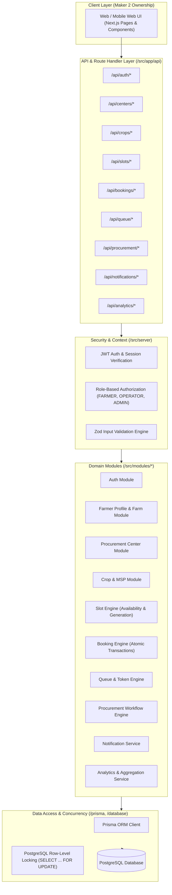

# KrishiQueue Architecture Document

## Overview
**KrishiQueue** (SIH26032) is a Digital Slot Booking & Procurement Queue Management System designed to eliminate unorganized mandi congestion, long farmer wait times, crop spoilage, and non-transparent grain procurement workflows across government and private procurement centers.

This document describes the modular monolith backend architecture, domain boundary separation, concurrency guarantees, and data flows.

---

## High-Level Architecture



---

## Directory Structure & Ownership Boundary

```text
KrishiQueue/
├── docs/                      # Shared System Documentation
│   ├── architecture.md        # System architecture and design
│   ├── database.md            # Schema, relations, indexes, constraints
│   ├── api-contract.md        # Maker 2 API endpoints, payloads, and response contracts
│   └── business-rules.md      # Concurrency rules, validation, and domain constraints
├── prisma/                    # Maker 1: Database Schema & Seeds
│   ├── schema.prisma
│   └── seed.ts
├── src/
│   ├── server/                # Maker 1: Core Backend Infrastructure
│   │   ├── db.ts              # Prisma singleton instance
│   │   ├── env.ts             # Validated environment variables
│   │   ├── auth.ts            # Password hashing, JWT signing/verification, RBAC
│   │   ├── errors.ts          # Standardized AppError & error mapping
│   │   └── context.ts         # Request context extractor (authenticated user)
│   ├── lib/
│   │   └── server/            # Maker 1: Backend utilities (locking, pagination, formatters)
│   ├── modules/               # Maker 1: Domain-Driven Modules
│   │   ├── auth/              # Registration, login, profile, password management
│   │   ├── farmers/           # Farmer verification, land details, crop declarations
│   │   ├── centers/           # Procurement centers, operators, operating hours, capacity
│   │   ├── crops/             # Crop types, varieties, MSP rates, center acceptance
│   │   ├── slots/             # Slot template generation, real-time availability calculation
│   │   ├── bookings/          # Concurrency-safe slot reservation, cancellation, audit
│   │   ├── queue/             # Token sequence generation, digital queue caller, live status
│   │   ├── procurement/       # QC grading, weighbridge records, receipt generation
│   │   ├── notifications/     # Event triggers, SMS/in-app alert storage
│   │   └── analytics/         # Daily center throughput, crop volumes, wait time trends
│   ├── app/
│   │   └── api/               # Maker 1: REST API Route Handlers consumed by Maker 2
│   │       ├── auth/
│   │       ├── farmers/
│   │       ├── centers/
│   │       ├── crops/
│   │       ├── slots/
│   │       ├── bookings/
│   │       ├── queue/
│   │       ├── procurement/
│   │       ├── notifications/
│   │       └── analytics/
│   ├── components/            # Maker 2: Frontend UI Components (DO NOT MODIFY)
│   ├── features/ui/           # Maker 2: Frontend UI Features (DO NOT MODIFY)
│   └── styles/                # Maker 2: Styling and CSS (DO NOT MODIFY)
└── tests/                     # Maker 1: Backend & Concurrency Test Suites
    ├── concurrency/           # Race-condition booking simulations
    ├── auth/                  # RBAC and session tests
    └── modules/               # Domain logic unit & integration tests
```

---

## Core Backend Design Principles

1. **Strict Concurrency Safety**:
   - Slot capacity is NEVER trusted to client-side checks.
   - All booking creation operations run inside isolated PostgreSQL transactions with explicit row locking (`SELECT ... FOR UPDATE` or atomic conditional counter updates).
   - Queue token sequence numbers are calculated atomically per center per date with database unique constraints `@@unique([centerId, date, tokenNumber])`.

2. **Defense in Depth**:
   - Every input payload is validated using strict **Zod** schemas.
   - Sensitive identifiers (`userId`, `role`, `farmerId`, `slotCapacity`, `queueNumber`) are strictly derived from the authenticated session context on the server.

3. **Standardized Response Envelope**:
   All API endpoints return a uniform response shape:
   ```typescript
   // Success response
   {
     "success": true,
     "data": { ... },
     "meta"?: { "page": 1, "limit": 20, "total": 100 }
   }

   // Error response
   {
     "success": false,
     "error": {
       "code": "SLOT_CAPACITY_EXCEEDED",
       "message": "The selected time slot is full.",
       "details"?: [ ... ]
     }
   }
   ```
