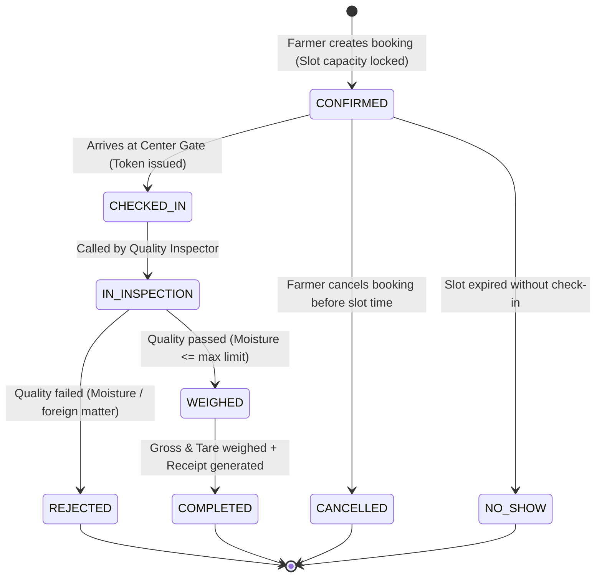

# KrishiQueue Business Rules & Concurrency Invariants

This document outlines the strict business constraints, state machines, and concurrency guarantees that govern the backend.

---

## 1. Concurrency Guarantees

### Invariant 1: Zero Overbooking Guarantee
- **Rule**: A Slot with `capacity = N` can NEVER have more than `N` active (non-cancelled) bookings, regardless of how many requests hit the server at the exact same millisecond.
- **Enforcement Strategy**:
  1. All booking transactions run in an isolated PostgreSQL transaction (`REPEATABLE READ` or `SERIALIZABLE` or explicit row-locking via `SELECT ... FOR UPDATE` on the `Slot` record).
  2. The transaction inspects `slot.bookedCount < slot.capacity`.
  3. If capacity is available, it atomically increments `bookedCount` by 1 and inserts the `Booking` record.
  4. If `slot.bookedCount >= slot.capacity`, the transaction throws a `SLOT_FULL` error and rolls back completely.
  5. When a booking is cancelled, `bookedCount` is atomically decremented by 1, and the slot status returns to `OPEN` if it was `FULL`.

### Invariant 2: Atomic Queue Token Sequencing
- **Rule**: Tokens issued for a given procurement center on a specific date MUST be strictly monotonically increasing (1, 2, 3...) with zero gaps and no duplicate token numbers.
- **Enforcement Strategy**:
  1. The token assignment queries `MAX(tokenNumber)` inside a locked transaction for the given `centerId` and `date`.
  2. A PostgreSQL unique constraint `@@unique([centerId, tokenDate, tokenNumber])` provides a database-level integrity barrier.

---

## 2. Slot & Booking State Machine

### Cancellation Constraints:
- Farmers may only cancel bookings when in `CONFIRMED` status.
- Bookings that have been `CHECKED_IN` or `IN_INSPECTION` cannot be cancelled by the farmer (must be resolved by the Center Operator).
- Upon cancellation, the slot `bookedCount` is atomically decremented, making the slot immediately available to other farmers.

---

## 3. Role-Based Permissions Matrix

| Resource / Action | FARMER | CENTER_OPERATOR | ADMIN |
| :--- | :---: | :---: | :---: |
| Register / Login | Yes | Yes | Yes |
| View Centers & Slots | Yes | Yes | Yes |
| Create Booking | Yes (Self only) | Yes (Assisted mode) | Yes |
| Cancel Booking | Yes (Self & CONFIRMED only) | Yes (Center bookings) | Yes |
| View Own Bookings | Yes | No | Yes |
| View Center Bookings / Queue | No | Yes (Assigned center) | Yes |
| Generate / Call Next Queue Token | No | Yes | Yes |
| Record Inspection & Weights | No | Yes | Yes |
| Generate Procurement Receipt | No | Yes | Yes |
| Manage Centers & Operators | No | No | Yes |
| Manage Crops & MSP Rates | No | No | Yes |
| View System Analytics | Limited (personal) | Center-level | System-wide |

---

## 4. Farmer Quota & Quality Rules

1. **Daily Limit**: A single farmer cannot hold more than 1 active booking for the same crop on the same calendar date at the same procurement center.
2. **Moisture Standard**: Procured grain moisture must not exceed the crop's `moistureLimitPercent` (e.g. 12.0% for Wheat). If moisture is exceeded by > 2%, the system forces a `REJECTED` state or applies an authorized deduction calculation.
3. **Receipt Immutability**: Once a `ProcurementRecord` is generated with completed status, financial fields (`ratePerQuintal`, `netWeightKg`, `totalAmount`) cannot be updated without administrative audit override.
