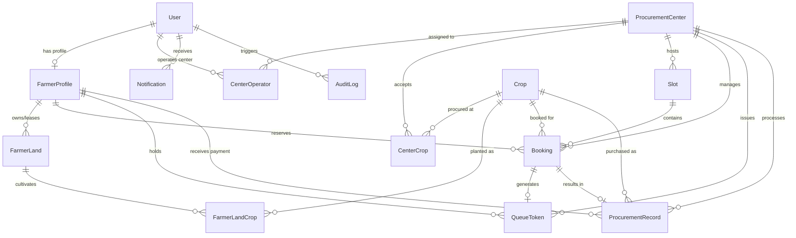

# KrishiQueue Database Design & Schema Specification

## Database Engine
- **RDBMS**: PostgreSQL
- **ORM**: Prisma ORM

---

## Entity-Relationship Overview

---

## Key Relational Models

### 1. `User`
Core authentication and role entity.
- `id` (UUID, PK)
- `phone` (VARCHAR(15), UNIQUE, indexed)
- `email` (VARCHAR(255), optional, UNIQUE)
- `name` (VARCHAR(100))
- `passwordHash` (TEXT)
- `role` (ENUM: `FARMER`, `CENTER_OPERATOR`, `ADMIN`)
- `status` (ENUM: `ACTIVE`, `SUSPENDED`, `PENDING_VERIFICATION`)
- `createdAt`, `updatedAt`

### 2. `FarmerProfile`
Extended details for registered farmers.
- `id` (UUID, PK)
- `userId` (UUID, UNIQUE, FK -> User.id)
- `aadhaarHash` (VARCHAR(64), UNIQUE)
- `farmerIdNumber` (VARCHAR(50), UNIQUE) — State/National Farmer ID (e.g., PM-KISAN ID)
- `state`, `district`, `taluk`, `village`, `pincode`
- `bankAccountNo`, `bankIfsc`, `bankName`
- `createdAt`, `updatedAt`

### 3. `ProcurementCenter`
Government APMC mandis or authorized procurement hubs.
- `id` (UUID, PK)
- `code` (VARCHAR(20), UNIQUE, indexed)
- `name` (VARCHAR(150))
- `address`, `district`, `state`, `pincode`
- `latitude`, `longitude` (Float, optional for geolocation)
- `dailyCapacityQuintals` (Decimal) — Max total grain procurement capacity per day
- `maxVehiclesPerHour` (Int) — Max throughput
- `operatingStartTime` (Time, e.g. "08:00")
- `operatingEndTime` (Time, e.g. "18:00")
- `isActive` (Boolean, default true)
- `createdAt`, `updatedAt`

### 4. `Crop`
Agricultural commodities eligible for Minimum Support Price (MSP) or procurement.
- `id` (UUID, PK)
- `code` (VARCHAR(30), UNIQUE) — e.g., `WHEAT_SHARBATI`, `PADDY_BASMATI`
- `name` (VARCHAR(100))
- `category` (ENUM: `CEREALS`, `PULSES`, `OILSEEDS`, `COMMERCIAL`, `OTHER`)
- `mspRatePerQuintal` (Decimal) — Current season MSP
- `procurementSeason` (VARCHAR(20)) — e.g., `KHARIF_2026`, `RABI_2026`
- `moistureLimitPercent` (Decimal, default 12.0)
- `isActive` (Boolean, default true)

### 5. `Slot`
Pre-configured or dynamic time slots for a specific center and date.
- `id` (UUID, PK)
- `centerId` (UUID, FK -> ProcurementCenter.id)
- `date` (DATE, indexed)
- `startTime` (VARCHAR(5)) — e.g., "09:00"
- `endTime` (VARCHAR(5)) — e.g., "10:00"
- `capacity` (Int) — Total allowed bookings in this slot window
- `bookedCount` (Int, default 0) — Concurrency counter tracked atomically
- `status` (ENUM: `OPEN`, `FULL`, `CANCELLED`, `COMPLETED`)
- `createdAt`, `updatedAt`
- **Constraint**: `@@unique([centerId, date, startTime])`
- **Index**: `@@index([centerId, date, status])`

### 6. `Booking`
A reserved drop-off appointment by a farmer.
- `id` (UUID, PK)
- `bookingReference` (VARCHAR(20), UNIQUE, indexed) — e.g., `BK-20261007-0042`
- `farmerId` (UUID, FK -> FarmerProfile.id)
- `centerId` (UUID, FK -> ProcurementCenter.id)
- `slotId` (UUID, FK -> Slot.id)
- `cropId` (UUID, FK -> Crop.id)
- `estimatedQuantityQuintals` (Decimal)
- `vehicleType` (ENUM: `TRACTOR_TROLLEY`, `TRUCK_SMALL`, `TRUCK_LARGE`, `PICKUP_VAN`, `OTHER`)
- `vehicleNumber` (VARCHAR(20))
- `driverName`, `driverPhone`
- `status` (ENUM: `CONFIRMED`, `CHECKED_IN`, `IN_INSPECTION`, `WEIGHED`, `COMPLETED`, `CANCELLED`, `NO_SHOW`, `REJECTED`)
- `cancellationReason` (TEXT, optional)
- `createdAt`, `updatedAt`
- **Constraint**: `@@index([farmerId, status])`
- **Constraint**: `@@index([centerId, slotId, status])`

### 7. `QueueToken`
Digital token allocated to a confirmed booking upon arrival or morning scheduling.
- `id` (UUID, PK)
- `bookingId` (UUID, UNIQUE, FK -> Booking.id)
- `centerId` (UUID, FK -> ProcurementCenter.id)
- `tokenDate` (DATE)
- `tokenNumber` (Int) — Sequential daily number (e.g. 1, 2, 3...)
- `tokenDisplay` (VARCHAR(20)) — e.g. `TK-001`, `WHT-042`
- `status` (ENUM: `WAITING`, `CALLED`, `AT_GATE`, `IN_QUALITY_CHECK`, `AT_WEIGHBRIDGE`, `UNLOADING`, `COMPLETED`, `SKIPPED`)
- `counterNumber` (VARCHAR(10), optional)
- `estimatedCallTime` (TIMESTAMP, optional)
- `actualCallTime` (TIMESTAMP, optional)
- `completedTime` (TIMESTAMP, optional)
- `createdAt`, `updatedAt`
- **Constraint**: `@@unique([centerId, tokenDate, tokenNumber])`
- **Index**: `@@index([centerId, tokenDate, status])`

### 8. `ProcurementRecord`
Final verification, quality grading, gross/tare weights, and payment clearance document.
- `id` (UUID, PK)
- `receiptNumber` (VARCHAR(30), UNIQUE, indexed) — e.g., `RCP-2026-00918`
- `bookingId` (UUID, UNIQUE, FK -> Booking.id)
- `centerId` (UUID, FK -> ProcurementCenter.id)
- `farmerId` (UUID, FK -> FarmerProfile.id)
- `cropId` (UUID, FK -> Crop.id)
- `operatorId` (UUID, FK -> User.id)
- `grossWeightKg` (Decimal)
- `tareWeightKg` (Decimal)
- `netWeightKg` (Decimal)
- `moisturePercent` (Decimal)
- `foreignMatterPercent` (Decimal)
- `qualityGrade` (ENUM: `GRADE_A`, `GRADE_B`, `GRADE_C`, `REJECTED`)
- `ratePerQuintal` (Decimal)
- `totalAmount` (Decimal)
- `paymentStatus` (ENUM: `PENDING_CLEARANCE`, `APPROVED`, `DISBURSED`, `FAILED`)
- `paymentReference` (VARCHAR(100), optional)
- `notes` (TEXT, optional)
- `createdAt`, `updatedAt`

### 9. `Notification`
Audit of real-time alerts dispatched to farmers and staff.
- `id` (UUID, PK)
- `userId` (UUID, FK -> User.id)
- `title` (VARCHAR(150))
- `message` (TEXT)
- `type` (ENUM: `SLOT_CONFIRMATION`, `QUEUE_CALL`, `TOKEN_ISSUED`, `QUALITY_PASSED`, `QUALITY_REJECTED`, `PAYMENT_DISBURSED`, `SLOT_CANCELLED`, `SYSTEM_ALERT`)
- `isRead` (Boolean, default false)
- `channel` (ENUM: `IN_APP`, `SMS`, `WHATSAPP`)
- `createdAt`

### 10. `AuditLog`
Immutable system audit trail for security and anti-tamper compliance.
- `id` (UUID, PK)
- `userId` (UUID, optional, FK -> User.id)
- `action` (VARCHAR(50))
- `entityType` (VARCHAR(50))
- `entityId` (VARCHAR(50))
- `ipAddress` (VARCHAR(45), optional)
- `metadata` (JSONB)
- `createdAt`
